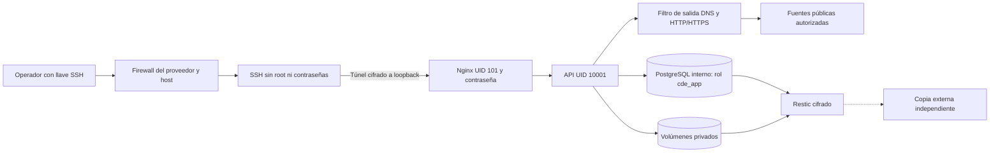

# CyberDecisionEngine en VPS privado

Para acceso con usuario y contraseña desde cualquier navegador por HTTPS,
consultar el [perfil público protegido](PUBLIC.md). Este documento describe
el perfil privado por túnel SSH.

Perfil para **un único operador de confianza**: Ubuntu 24.04 LTS x86-64,
Docker Engine del repositorio oficial y Compose 2.24.4 o posterior (incluye v5).
Conservar el sistema de un VPS existente; esta configuración no reinstala discos.
Capacidad inicial: 4 vCPU, 8 GB RAM mínimo recomendado; 16 GB ofrece margen para
construcciones y sistema. No incluye inferencia local ni recolectores pesados.



## Límites efectivos

- Solo web publica un puerto: `127.0.0.1:18080`. API y PostgreSQL no publican
  puertos. Redes separadas para base de datos, aplicación, salida e ingreso.
- API y web usan usuarios sin privilegios, raíz de solo lectura, capacidades
  eliminadas, prohibición de privilegios nuevos, límites de CPU/RAM/PID y logs
  rotados. No se monta el socket Docker. PostgreSQL mantiene su volumen propio.
- `operator.yml` exige contraseña HTTP Basic en el servidor para aplicación,
  API, informes y bootstrap. Solo `/healthz` es público y devuelve `ok` estático.
  Se rechazan solicitudes de navegador con origen externo.
  HTTP recorre el túnel SSH cifrado; no se ofrece HTTP ni HTTPS público.
- La identidad `superadmin` inicializa la interfaz local existente. Nginx y SSH
  son los controles efectivos de acceso. **No hay SSO/MFA, autorización por
  usuario de backend ni aislamiento entre empresas**. No habilitar otros
  operadores ni acceso público sin implementar esos controles.
- La cuenta de aplicación `cde_app` no es superusuario y no crea roles ni bases.
  El secreto de `cde_dbadmin` se monta únicamente en PostgreSQL.
- `egress-firewall.sh` bloquea conexiones nuevas al host desde los cuatro
  puentes, y destinos privados, loopback y metadatos desde las redes de salida
  e ingreso. Permite DNS y HTTP/HTTPS públicos. IPv6 de estas redes Docker está
  deshabilitado. No es una lista de dominios autorizados ni elimina todo SSRF.
- Un único VPS sigue siendo un punto único de fallo. Reinicios y backups no son
  alta disponibilidad. Docker reinicia procesos caídos, no contenedores solo
  por estar `unhealthy`; el monitor registra esos fallos.

## Instalación

Usar exclusivamente un clon público verificado en `/opt/cde/app`, fijado a un
commit revisado. **No copiar informes, recolecciones, bases locales, capturas,
`.env`, claves ni el checkout de trabajo del operador.** El inicializador copia
solo catálogos públicos de `scripts/vps_reference_files.txt` a volúmenes nuevos.
El token del proveedor permanece en el equipo del operador.

1. Instalar Docker desde su repositorio oficial, `apache2-utils`, `restic`, UFW,
   Fail2ban y actualizaciones de seguridad. Verificar que el VPS esté disponible
   antes de modificar servicios. Conservar una vía de recuperación en hPanel.
2. Crear un usuario de operación con llave SSH y probar una segunda conexión
   antes de deshabilitar root remoto y autenticación por contraseña. Restringir
   forwarding al destino `127.0.0.1:18080`; deshabilitar agent/X11 forwarding.
3. Firewall del proveedor y host: denegar ingreso salvo SSH; limitar intentos y
   activar Fail2ban. Cuando se disponga de IP fija/VPN, restringir también su
   origen. Cubrir IPv4/IPv6. No abrir puertos de aplicación o base de datos.
4. Preparar secretos fuera del repositorio, con directorio padre solo para root:

```sh
sudo install -d -m 700 /etc/cde/secrets
sudo sh -c 'umask 077; for name in db_password db_admin_password; do test -f /etc/cde/secrets/$name || openssl rand -hex 32 > /etc/cde/secrets/$name; done'
sudo chmod 444 /etc/cde/secrets/db_password /etc/cde/secrets/db_admin_password
sudo python3 scripts/vps_operator_setup.py
export CDE_SECRET_DIR=/etc/cde/secrets
export CDE_RELEASE="$(git rev-parse --short=12 HEAD)"
sudo --preserve-env=CDE_SECRET_DIR,CDE_RELEASE docker compose \
  -f deploy/vps/compose.yml -f deploy/vps/operator.yml build api web
sudo --preserve-env=CDE_SECRET_DIR,CDE_RELEASE docker compose \
  -f deploy/vps/compose.yml -f deploy/vps/operator.yml up -d --wait
sudo --preserve-env=CDE_RELEASE bash deploy/vps/install-operations.sh
```

En una base nueva, `create-app-db.sh` crea el rol y base de aplicación. Si ya
existe el volumen del perfil básico, respaldar primero y ejecutar
`scripts/vps_database_roles.py` antes de activar el perfil de operador. No borrar
volúmenes. El rol bootstrap original permanece administrativo, con su contraseña
rotada; la API usa exclusivamente el nuevo rol limitado.

## Acceso

Entregar `/etc/cde/secrets/operator-credentials.json` por canal privado. Tiene
permisos 600; nunca publicarlo. Verificar la llave del host y abrir un túnel:

```sh
ssh -N -L 127.0.0.1:18080:127.0.0.1:18080 operador@VPS
```

Visitar `http://127.0.0.1:18080/operator-setup.html` e introducir las credenciales.
La página, protegida y sin caché, configura el superadministrador de la UI sin
incluir cuentas privadas en imágenes públicas. Usar siempre el mismo hostname
local: `localhost` y `127.0.0.1` tienen almacenamiento de navegador separado.
El logout de la interfaz no revoca HTTP Basic del navegador: cerrar el túnel
para terminar el acceso remoto. Cambiar credenciales exige actualizar el archivo
privado y ejecutar el generador; una modificación solo en la UI no cambia Nginx.

## Operación y recuperación

`install-operations.sh` instala unidades systemd y genera la clave restic fuera
de Git. Ejecuta la primera copia, programa copias a las 03:30 UTC con hasta diez
minutos de variación y comprobaciones locales cada cinco minutos. Reaplica el
filtro de contenedores al arrancar Docker. Después de recrear redes o recargar
UFW, reiniciar `cde-firewall.service` y verificar sus reglas antes de operar.

`backup.sh` pausa brevemente la API, exporta PostgreSQL y ambos volúmenes,
reanuda el servicio y cifra los archivos junto con configuración/secretos y el
commit. Elimina su staging privado incluso ante errores. Guarda 7 copias diarias,
4 semanales y 3 mensuales; verifica integridad. El repositorio queda en
`/var/backups/cde/repository`; clave en `/etc/cde/secrets/backup-password`.
Mantener una copia cifrada externa y la clave por separado: la copia local no
sobrevive a perder el servidor. La réplica externa continua requiere un destino
independiente que este perfil no provisiona. RPO 24 h/RTO 4 h son objetivos por
validar con datos representativos, no garantías.

El monitor comprueba salud de servicios, disco inferior al 80 % y backup con
menos de 26 horas. Registra fallos localmente; las alertas externas requieren
un destino independiente. Para restaurar, extraer restic en un directorio
privado y probar PostgreSQL en una base aislada antes de sustituir producción.

Actualizar a commits revisados: construir antes de detener servicios, guardar
backup e imagen anterior, mantener los volúmenes y ejecutar nuevamente las
pruebas. No usar `down -v`. Un rollback de código requiere esquema compatible;
no restaurar automáticamente datos antiguos sobre actividad nueva.

## Aceptación

Probar rechazo de credenciales ausentes/incorrectas, login de superadmin,
consulta de API, ausencia de colecciones importadas, privilegios de DB, salida
pública y bloqueo privado, ausencia de puertos API/DB, backup y restauración
completa aislada, y recuperación después de reiniciar el VPS. No iniciar
recolecciones reales solo para comprobar la instalación.

Fuentes oficiales: [Docker Ubuntu](https://docs.docker.com/engine/install/ubuntu/),
[Docker y firewall](https://docs.docker.com/engine/network/packet-filtering-firewalls/),
[Restic: restauración](https://restic.readthedocs.io/en/stable/050_restore.html).
