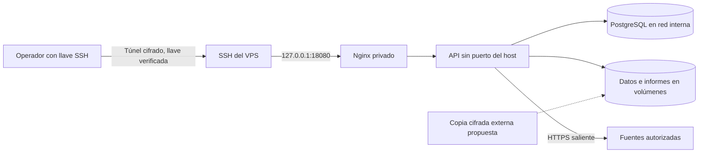

# CyberDecisionEngine en VPS privado

Configuración inicial para un único operador de confianza. Debian 13 x86-64 sin
panel ni escritorio, Docker Engine y Compose v2 del repositorio oficial de Docker.
Esta configuración NO convierte la autenticación local de la interfaz en control
server-side y NO está aprobada para SaaS multiusuario ni acceso público directo.

## Límites de confianza



Solo el servicio web se publica, exclusivamente en loopback. La base de datos y
la API no publican puertos. PostgreSQL utiliza una red interna separada; la API
conserva salida a fuentes externas. Esta salida todavía no tiene un proxy de
allowlist: la contención SSRF y las restricciones a destinos privados deben
validarse antes de admitir usuarios que no sean el operador de confianza.

La API corre con UID 10001, sin capacidades Linux, sin privilegios nuevos y con
raíz de solo lectura. Los volúmenes guardan únicamente el estado de esta nueva
instalación. CPU, memoria, procesos y registros tienen límites. Las integraciones
pesadas y la IA están deshabilitadas en este perfil inicial. Se habilitarán en
redes separadas después de medir su consumo y revisar su alcance autorizado.

## Capacidad inicial

Estimación de arranque, no benchmark: 4 vCPU y 8 GB RAM, al menos 80 GB SSD,
para API, PostgreSQL y web con un informe concurrente y sin inferencia local.
En Hostinger, KVM 4 ofrece 4 vCPU/16 GB y deja mayor margen para este perfil.
El límite de los contenedores suma aproximadamente 4.2 GB más procesos de build,
Docker y sistema operativo. No elegir un plan menor sin medir. Para IA y
recolectores pesados, evaluar 16 GB o separar esos trabajadores. Un único VPS
es un punto único de fallo; reinicios y backups no equivalen a alta disponibilidad.

## Instalación

Usar exclusivamente un clon del repositorio público verificado. No copiar el
checkout de trabajo del operador, informes, bases locales, perfiles, capturas,
`.env` ni copias de recuperación. El token API de Hostinger permanece en el
equipo del operador y no se entrega a los contenedores ni a GitHub.

1. Verificar que el VPS esté vacío antes de instalar o cambiar el SO. Reinstalar
   un VPS existente borra su disco; la configuración no ejecuta esa operación.
2. Instalar Docker siguiendo https://docs.docker.com/engine/install/debian/ y
   verificar el repositorio de paquetes. Crear un operador con sudo y llave SSH.
3. Probar una segunda sesión SSH antes de deshabilitar passwords y root remoto.
   Restringir el firewall de Hostinger a SSH desde la IP/VPN del operador,
   incluyendo IPv6. No abrir 8000, 5432, 8080 ni 18080. Mantener desactivado el
   enrutamiento directo a contenedores; UFW por sí solo no filtra todos los
   puertos publicados por Docker.
4. Habilitar actualizaciones de seguridad del SO y una ventana de reinicio
   supervisada. Configurar sincronización de hora y alertas de disco y memoria.
5. Clonar la rama pública y fijar un commit revisado. Generar el secreto fuera
   del repositorio y construir el perfil:

```sh
sudo install -d -m 700 /etc/cde/secrets
sudo sh -c 'umask 077; test -f /etc/cde/secrets/db_password || openssl rand -hex 32 > /etc/cde/secrets/db_password'
# The non-root API must read the mounted secret; the parent remains root-only.
sudo chmod 444 /etc/cde/secrets/db_password
export CDE_SECRET_DIR=/etc/cde/secrets
export CDE_RELEASE="$(git rev-parse --short=12 HEAD)"
sudo --preserve-env=CDE_SECRET_DIR,CDE_RELEASE docker compose -f deploy/vps/compose.yml build api web
sudo --preserve-env=CDE_SECRET_DIR,CDE_RELEASE docker compose -f deploy/vps/compose.yml up -d --wait
```

`initialize` copia solo los catálogos públicos enumerados en
`scripts/vps_reference_files.txt` cuando no existen. No copia la raíz completa de
datos. Los catálogos adicionales se descargan de sus fuentes oficiales mediante
`scripts/sync_cti_knowledge.py` dentro del contenedor, y quedan en su volumen.
No se sincronizan desde las recolecciones del equipo del operador.

Abrir el acceso desde el equipo autorizado, verificando previamente la huella
SSH mediante hPanel:

```sh
ssh -N -L 18080:127.0.0.1:18080 operador@VPS
```

Navegar a `http://localhost:18080`. El tramo remoto va cifrado por SSH; este
perfil no ofrece HTTPS público. La interfaz pública no incluye cuentas de
laboratorio. El alta de identidad debe resolverse por canal privado; no publicar
usuarios ni hashes en JavaScript. Para usuarios adicionales se requiere integrar
SSO/MFA y autorización de backend antes de abrir el acceso.

## Recuperación y actualizaciones

Diseño requerido antes de operar con información importante; el repositorio no
provisiona aún el destino externo de copias ni su clave de cifrado:

- Copia coherente: pausar API, exportar PostgreSQL y respaldar ambos volúmenes
  de ejecución en una misma ventana; reactivar la API aun cuando falle el backup.
- Cifrar antes de salir del VPS, enviar a una cuenta/ubicación independiente,
  limitar las credenciales del backup y conservar la clave fuera del servidor.
- Objetivos iniciales propuestos: RPO 24 h y RTO 4 h. Solo aceptarlos después de
  una restauración completa en un entorno aislado. Retención propuesta: 7
  diarias, 4 semanales y 3 mensuales, sujeta al volumen y presupuesto.
- Alertar externamente si falla la copia, aumenta el uso de disco sobre 80 %,
  faltan heartbeats, hay OOM o fallan healthchecks. Docker reinicia procesos que
  salen, pero NO reinicia automáticamente un contenedor solo por estar unhealthy.
- Desplegar commits fijos; construir imágenes antes de detener servicios.
  Conservar la imagen previa y una copia previa a migraciones. No ejecutar
  `down -v`, borrar volúmenes ni actualizar por `git pull` sin validación.
- El rollback de código solo es seguro si el esquema de datos sigue siendo
  compatible. No restaurar automáticamente una copia que perdería datos nuevos.

No hay balanceador, segundo nodo ni failover en este perfil. Si se requiere
continuidad durante una caída del proveedor o del VPS, separar trabajadores y
base de datos, añadir réplica y ensayar failover con al menos dos nodos.

## Verificación de aceptación

Validar salud y persistencia tras recrear API/web; comprobar externamente por
IPv4 e IPv6 que solo SSH sea accesible desde la lista permitida; comprobar que
API/DB no tienen puertos publicados y que no existe socket Docker montado;
confirmar la restauración cifrada y las alertas. Un escaneo de secretos del
repositorio no sustituye pruebas de autorización, SSRF o aislamiento por empresa.

Fuentes: [Hostinger: sistemas disponibles](https://www.hostinger.com/support/1583571-what-are-the-available-operating-systems-for-vps-at-hostinger/),
[Docker: Debian](https://docs.docker.com/engine/install/debian/),
[Docker: firewall](https://docs.docker.com/engine/network/packet-filtering-firewalls/).
