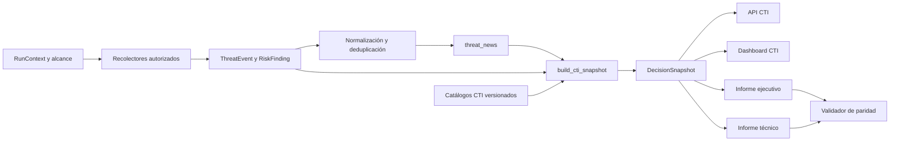

# Arquitectura CTI Threat-Informed

## Propósito

El módulo **CTI - Threat-Informed Intelligence** consolida actores, campañas,
técnicas, contramedidas y evidencia de una corrida sin duplicar la lógica de
OSINT, SOCMINT, superficie, fraude o escenarios. Su contrato canónico es
`metrics.cti` y se persiste dentro de `decision_snapshot.cti_snapshot`.

Dashboard, API e informes consumen ese mismo snapshot. Ninguna vista vuelve a
calcular conteos, estados o relevancia.

## Flujo de datos



## Estados semánticos

| Estado | Significado | Condición mínima |
|---|---|---|
| `OBSERVED` | Comportamiento adversario observado en el alcance | telemetría adversaria confirmada, activo, tiempo y evidencia enlazada |
| `INFERRED` | Hipótesis analítica trazable | evidencia enlazada y regla explícita, sin presentarla como hecho |
| `RELATED` | Contexto relevante | ajuste de sector, tecnología, geografía o TTP |
| `REFERENCE` | Conocimiento de marco | catálogo o nodo de contexto sin afirmación sobre el objetivo |

Una noticia, una coincidencia textual o una relación sectorial no pueden elevar
por sí solas un actor, campaña o TTP a `OBSERVED`.

## Relevancia contextual

El modelo `cde-cti-relevance-v1.0.0` ordena revisión; no expresa probabilidad de
ataque ni confirma incidentes.

```text
R = 100 * (0.25E + 0.20T + 0.15V + 0.15S + 0.10G + 0.10C + 0.05D)
```

Donde cada factor está normalizado en `[0,1]`:

- `E`: evidencia directa;
- `T`: coincidencia de TTP;
- `V`: ajuste tecnología-vulnerabilidad;
- `S`: ajuste sectorial;
- `G`: ajuste geográfico;
- `C`: recencia de campaña;
- `D`: diversidad de fuentes.

Un factor ausente aporta cero y queda registrado como limitación. No se imputa
con IA. El resultado se limita a `[0,100]` y conserva los aportes por factor.

## Contrato CTI

`cti_snapshot` contiene:

- `scope`, versión de esquema y versión de modelo;
- `overview` con conteos derivados de las listas canónicas;
- `actors`, `campaigns`, `techniques` y sus `evidence_ids`;
- matriz ATT&CK, flujos, victimología y grafo;
- cobertura de detección y controles D3FEND;
- índice de evidencia con actores, campañas y técnicas enlazados;
- calidad, limitaciones y versiones de conocimiento.

Los identificadores son estables dentro de la corrida. Una campaña conserva sus
propios `evidence_ids`; no hereda observación de un actor sin evidencia común.

## API

- `GET /api/cti/runs/{run_id}`: snapshot completo.
- `GET /api/cti/runs/{run_id}/{section}`: slice canónico.
- `GET /api/cti/knowledge`: manifiesto de fuentes y hashes.
- `POST /api/admin/cti/knowledge/sync`: actualización administrativa.
- `POST /api/admin/cti/knowledge/rollback`: restauración LKG.

Las operaciones administrativas exigen `X-Admin-Key` y
`CDE_ADMIN_API_KEY`. Si la variable no existe, el endpoint falla cerrado.

## Validaciones de publicación

El validador rechaza:

- conteos diferentes entre snapshot e informe (`CTI_COUNT_MISMATCH`);
- evidencia huérfana (`CTI_EVIDENCE_ORPHAN`);
- `OBSERVED` sin telemetría (`CTI_OBSERVED_WITHOUT_TELEMETRY`);
- pesos o scores fuera de rango (`CTI_SCORE_INVALID`);
- diferencias entre marcadores del informe y snapshot (`CTI_RENDER_MISMATCH`).

El informe ejecutivo muestra una lectura compacta. El técnico conserva la
traza actor-campaña-TTP-D3FEND-evidencia y sus limitaciones.

## Límites

- Los catálogos son conocimiento de referencia, no evidencia de una corrida.
- D3FEND indica contramedidas relacionadas, no controles implementados.
- La cobertura de mapeo no equivale a cumplimiento ni efectividad interna.
- Attack Flow organiza secuencias respaldadas; no inventa pasos ausentes.
- TIE permanece como capacidad de referencia hasta existir una integración
  reproducible y validada.
