# Flujo de extremo a extremo

```mermaid
flowchart LR
  A["Alcance autorizado"] --> B["Fuentes registradas"]
  B --> C["Elegibilidad y configuracion"]
  C --> D["Recoleccion aislada"]
  D --> E["Evidencia original y hash"]
  E --> F["Normalizacion"]
  F --> G["Deduplicacion"]
  G --> H["Entidades y relaciones"]
  H --> I["Geolocalizacion"]
  I --> J["Claims y evidencia"]
  J --> K["Escenarios respaldados"]
  K --> L["Frameworks y controles"]
  L --> M["Calculos versionados"]
  M --> N["DecisionSnapshot"]
  N --> O["Dashboard"]
  N --> P["Informe bajo demanda"]
  P --> Q["Validador HTML, JSON y CSV"]
```

## Propietarios y contratos

| Paso | Componente | Objeto persistido | Regla |
|---|---|---|---|
| alcance | web + API | solicitud del `runId` | organizacion, dominios y ventana explicitos |
| elegibilidad | configuracion de fuentes | `SourceStatus` | no contar deshabilitadas como consultadas |
| recoleccion | collectors/sidecars | respuesta original | preservar fuente, fecha y referencia |
| normalizacion | pipeline | `ThreatEvent` | no altera evidencia original |
| deduplicacion | evidence pipeline | canonical ID/hash | duplicados no incrementan riesgo |
| entidades | entity resolution | nodos y relaciones | inferencias marcadas y trazables |
| geografia | geo intelligence | precision/confianza | no usar coordenadas arbitrarias |
| semantica | claim-evidence | claims/links | una fuente real no hace verdadera una afirmacion |
| escenarios | decision intelligence | candidatos respaldados | plantilla no equivale a escenario activo |
| calculos | risk engine | version + entradas | faltante no equivale a cero |
| salida | snapshot | `DecisionSnapshot` | misma fuente para UI, HTML, JSON y CSV |

## Estados de ejecucion

| Estado | Entrada | Salida | Transicion valida |
|---|---|---|---|
| `queued` | solicitud validada | identificador y estimacion | `running` o `failed` |
| `running` | worker activo | progreso, etapas y resultados parciales | `completed` o `failed` |
| `completed` | contexto persistido | snapshot consultable | informe opcional |
| `failed` | error persistido | diagnostico y trazas sin secretos | reejecucion crea otro `runId` |

## Consistencia de salida

Dashboard, informe ejecutivo, informe tecnico, JSON y CSV deben derivarse del
mismo contexto persistido. El HTML no recalcula scores ni reclasifica evidencia;
solo representa el snapshot y registra versiones metodologicas.
