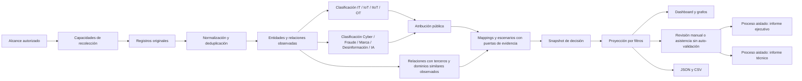

# Arquitectura de inteligencia multidominio

**Versión:** 1.1.0
**Fecha:** 2026-08-26
**Alcance:** IT, IoT, IIoT, OT, Cyber, Fraude, Marca, Desinformación e IA.

## Principio rector

CyberDecisionEngine conserva una única fuente de verdad por `runId`. La
clasificación multidominio enriquece el snapshot; los filtros crean una copia
proyectada y nunca modifican ni recollectan la corrida original.

## Capas y contratos

1. **Original:** respuesta o referencia recolectada, hash, fecha y procedencia
   interna. No se sobrescribe.
2. **Normalizada:** URL canónica, entidad, dominio, tipo de registro y estado de
   evidencia.
3. **Multidominio:** `technology_domains`, `analysis_domains`, atribución
   pública, mappings y referencias de escenario.
4. **Decisión:** hallazgo, impacto, confianza, limitación y opción de cierre.
5. **Presentación pública:** elimina nombres y campos internos, conserva la
   capacidad pública y referencias verificables.

La procedencia técnica permanece en campos `internal_*` y trazas del operador.
`sanitize_public_payload` gobierna la frontera pública de API, dashboard,
informes y exportaciones.

## Atribución pública

| Estado | Condición mínima | Lo que no significa |
|---|---|---|
| posible | coincidencia contextual | pertenencia al sujeto |
| relacionada | relación con alcance, aún insuficiente | activo confirmado |
| observada públicamente | relación directa o validada | inventario interno |
| corroborada públicamente | dos referencias independientes | compromiso |
| confirmada | método de confirmación y evidencia explícita | incidente, salvo impacto demostrado |

Una mención de PLC, gateway, cámara o protocolo puede clasificar el dominio
tecnológico, pero no confirma que el sujeto lo opere. Un advisory no es una CVE
aplicable sin producto y versión o CPE justificables.

## Relaciones y grafos

Las aristas se publican solo cuando comparten una entidad observada o existe una
relación explícita en la evidencia. La coincidencia de palabras no crea una
relación semántica. Los grafos reciben la misma proyección de filtros que las
tablas y reportes, y conservan `evidence_ids` para abrir el detalle.

El análisis de relaciones distingue proveedores, competidores y actores. Un
actor atribuido nunca se reclasifica como proveedor. Los proveedores declarados
permanecen como contexto hasta que un registro asegurado sustente una señal de
riesgo. Los competidores enriquecen Porter/PESTEL y tienen efecto técnico nulo
por declaración.

La detección de ciberocupación trabaja únicamente con hosts observados en la
corrida y calcula similitud, distancia de edición y tipos de variación. Excluye
dominios propios, sus subdominios y comparativos. La similitud no confirma
phishing, fraude ni control adversario.

## Revisión de evidencia e informes

El usuario selecciona revisión manual o asistida antes del informe. La opción
asistida genera propuestas deterministas con explicación y referencias, pero no
modifica el estado de evidencia. Toda validación o descarte definitivo pasa por
`review_evidence`, registra revisor, razón y fecha, recalcula el snapshot e
invalida el informe anterior.

La preparación y el renderizado HTML se ejecutan en un `ProcessPoolExecutor`
con concurrencia configurable. El servidor web conserva la atención a
solicitudes y progreso mientras el proceso de informe usa una copia persistida
del contexto. Al finalizar, el contexto preparado, los HTML, JSON, CSV y el
validador deben compartir `runId`, `snapshot_hash` y versión del generador.

## Riesgo y controles desconocidos

La presión de señales y la suficiencia de evidencia son índices descriptivos,
no probabilidades. Si no existe evidencia de controles, el estado es
`insufficient_control_evidence`; no se publica un riesgo residual como conocido.

## Operación y rendimiento

- El núcleo web, API, base de datos, recolección y reportes inicia sin IA.
- La asistencia analítica se habilita con `docker compose --profile ai up -d`.
- Los catálogos geográficos permanecen diferidos y fuera del chunk inicial.
- Los servicios de recolección tienen límites de CPU, memoria y procesos.
- Una integración fallida degrada su capacidad y no detiene el snapshot.

## Advertencia obligatoria

> Este análisis se basa en evidencia pública y observaciones externas consolidadas por CyberDecisionEngine. No constituye un inventario interno, auditoría, prueba de compromiso, confirmación de firmware instalado ni certificación de cumplimiento.
