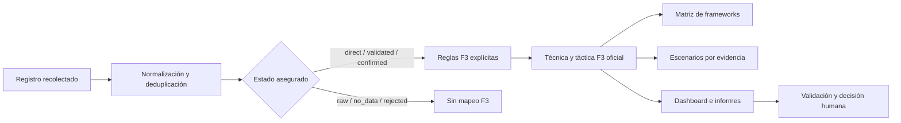

# Integración de MITRE Fight Fraud Framework (F3)

## Decisión

CyberDecisionEngine incorpora MITRE Fight Fraud Framework (F3) v1.1 como
taxonomía antifraude versionada. F3 complementa ATT&CK, D3FEND, ATLAS y DISARM;
no reemplaza el modelo de evidencia, riesgo ni validación de la plataforma.

Fuente oficial:

- https://ctid.mitre.org/fraud
- https://github.com/center-for-threat-informed-defense/fight-fraud-framework

El catálogo local conserva los 131 registros publicados en v1.1: 8 tácticas y
123 técnicas. La sincronización valida estructura, identificadores y versión
antes de reemplazar el caché local.

## Flujo

## Gobierno analítico

- Solo se mapean registros `direct`, `validated` o `confirmed`.
- Cada regla enlaza una categoría, etiqueta o frase explícita con un
  identificador oficial existente en el catálogo.
- El resultado se publica como `evidence_supported_candidate`.
- La biblioteca contiene escenarios preventivos F3, pero solo activa aquellos
  cuyo identificador coincide con evidencia de la corrida actual.
- No se reutilizan evidencias, enlaces o resultados de una corrida anterior.
- F3 no calcula probabilidad de ataque, pérdida, impacto financiero ni fraude.
- La coincidencia F3 no se presenta como fraude o incidente confirmado.

## Superficies de producto

| Superficie | Uso |
|---|---|
| Marca y fraude | Resume técnicas, tácticas y registros relacionados |
| Mapeo de frameworks | Cruza evidencia con el eje fraude y controles asociados |
| Escenarios | Activa candidatos F3 por coincidencia exacta de técnica |
| Tablero estratégico | Presenta impacto de decisión sin duplicar un menú |
| Informe ejecutivo | Expone una lectura compacta y sus limitaciones |
| Informe técnico | Lista técnica, táctica, estado y referencias de evidencia |
| Uso y modelo | Explica propósito, condiciones y límites |

## Trazabilidad

Cada mapeo conserva:

- versión del motor;
- versión y hash del catálogo;
- técnica oficial;
- tácticas oficiales;
- base de coincidencia;
- identificador de evidencia;
- URL, cuando existe;
- estado de validación.

Las pruebas deben fallar si una regla referencia una técnica inexistente, si un
registro no asegurado activa F3 o si un escenario F3 se activa por texto sin un
mapeo explícito.
