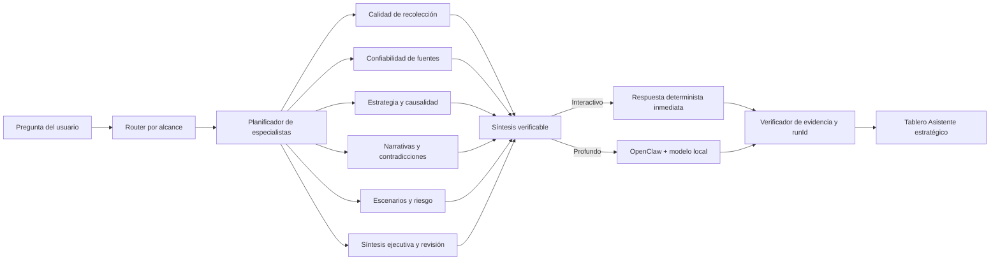

# Arquitectura multiagente para análisis de ciberinteligencia

## Decisión

CyberDecisionEngine utiliza una arquitectura híbrida de agentes especializados.
Los agentes no son procesos autónomos con modelos, memorias o permisos
independientes. Cada uno ejecuta un reductor determinista sobre la fuente de
verdad de una sola organización y un solo `runId`.

La conversación interactiva combina esas reducciones de inmediato. El análisis
profundo envía una cápsula compacta a una única síntesis OpenClaw con modelo
local. Toda salida pasa después por validación determinista de referencias.

## Flujo

## Especialistas

| Agente | Responsabilidad |
| --- | --- |
| `CollectionQualityAgent` | Cobertura, errores, duplicados y estado de recolección. |
| `SourceReliabilityAgent` | Corroboración, actualidad, diversidad y limitaciones. |
| `StrategicEvidenceAgent` | Contexto PESTEL y Porter respaldado por la corrida. |
| `CyberCausalAnalysisAgent` | Cadena señal, exposición, consecuencia y limitación. |
| `NarrativeIntelligenceAgent` | Menciones, narrativas y relaciones SOCMINT públicas. |
| `FactCheckContradictionAgent` | Contradicciones y riesgo de falso positivo. |
| `ScenarioBuilderAgent` | Escenarios candidatos o respaldados según evidencia. |
| `RiskExplanationAgent` | Explicación de riesgo sin convertir señal en probabilidad. |
| `ExecutiveBriefAgent` | Lectura breve para decisión. |
| `ReportReviewAgent` | Consistencia entre evidencia, métricas y recomendaciones. |

## Modos de ejecución

### Interactivo

- máximo tres especialistas;
- reducción determinista por alcance;
- sin espera de LLM;
- validación de todas las referencias;
- respuesta disponible aunque OpenClaw u Ollama estén detenidos.

### Profundo

- máximo seis especialistas;
- una sola cápsula compacta;
- una síntesis OpenClaw con modelo local;
- límite de tiempo, contexto y salida;
- degradación a síntesis determinista cuando el modelo no termina.

## Razón de eficiencia

Ejecutar un LLM por agente duplicaría la evidencia, multiplicaría tokens y
competiría por CPU y memoria. El diseño elegido conserva especialización sin
ese costo: los reductores comparten la misma corrida, no escriben estado y no
repiten contexto. Solo el modo profundo consume inferencia generativa.

## Fuente de verdad

Dashboard, conversación, informe ejecutivo, informe técnico, JSON y CSV leen el
mismo `DecisionIntelligenceSnapshot`. El ciclo de fuentes diferencia:

1. registradas en catálogo;
2. elegibles para la corrida;
3. consultadas;
4. exitosas a nivel técnico;
5. productivas con registros aceptados;
6. vacías, degradadas, fallidas u omitidas.

Una fuente productiva no equivale a evidencia validada. Una fuente exitosa puede
terminar sin registros.

## Controles

- aislamiento por organización y `runId`;
- contenido externo tratado como dato, no como instrucción;
- referencias ajenas a la corrida rechazadas;
- OpenClaw sin shell, navegación ni escritura;
- informes generados únicamente por solicitud;
- trazabilidad de agente, estado, modo y limitación;
- recolección, riesgo y reportes operan aunque la IA no esté disponible.
