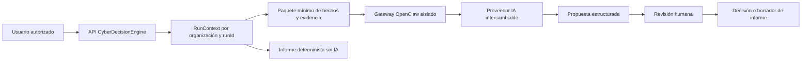

# OpenClaw como capa reemplazable de IA CTI

## Estado real

CyberDecisionEngine despliega un gateway OpenClaw aislado, generación de paquetes de análisis y pruebas de seguridad. Docker Compose lo inicia por defecto, pero la recolección, los cálculos, el dashboard y los informes no dependen de él. La disponibilidad del gateway y la disponibilidad de un modelo son estados distintos.

Variables:

- `OPENCLAW_ENABLED=true`;
- `OPENCLAW_GATEWAY_URL=http://openclaw-gateway:18789`;
- `OPENCLAW_GATEWAY_TOKEN_FILE=/run/openclaw/gateway-token`;
- `OPENCLAW_AUTOMATION_MODE=analysis_only`.

## Flujo

El paquete incluye `run_id`, versión del prompt, manifiesto de evidencia, límites de tokens, hechos utilizados y esquema de salida. El contenido externo se trata como dato no confiable, nunca como instrucción.

## Capacidades permitidas

- explicar resultados ya calculados;
- priorizar y correlacionar evidencia sin alterar el original;
- señalar contradicciones y faltantes;
- proponer consultas, fuentes y reintentos seguros;
- preparar borradores ejecutivos y técnicos;
- revisar consistencia antes de publicación;
- proponer planes de trabajo para aprobación humana.

## Capacidades prohibidas

- inventar evidencia o convertir hipótesis en hechos;
- modificar scores o publicar informes automáticamente;
- ejecutar shell, navegación, scraping, cron o acciones destructivas desde una respuesta generada;
- evadir controles, bloqueos o términos de una fuente;
- acceder a otra organización o a secretos no asignados.

## Roles evaluados

Los roles objetivo son `CollectionQualityAgent`, `EvidenceNormalizationAgent`, `EntityResolutionAgent`, `SOCMINTGraphAgent`, `GeoIntelligenceAgent`, `ThreatMappingAgent`, `RiskExplanationAgent`, `ReportReviewAgent`, `ExecutiveBriefAgent` y `SourceReliabilityAgent`. En el estado actual se implementa el contrato común de propuesta y planificación; no se presentan esos roles como servicios autónomos desplegados.

## Degradación

Con gateway deshabilitado, sin modelo, caído o fuera de licencia, la API conserva la ruta determinista. El fallo del proveedor se registra y no bloquea la ejecución ni el informe.
