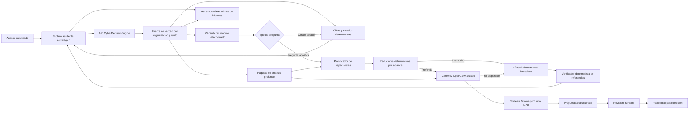

# OpenClaw como capa reemplazable de IA CTI

La decisión detallada sobre especialización, modos y eficiencia se conserva en
[`multiagent-decision.md`](multiagent-decision.md).

## Estado real

CyberDecisionEngine despliega un gateway OpenClaw aislado, generación de paquetes de análisis y pruebas de seguridad. Docker Compose lo inicia por defecto, pero la recolección, los cálculos, el dashboard y los informes no dependen de él. La disponibilidad del gateway, Ollama y cada modelo son estados distintos. El despliegue local utiliza síntesis determinista para la conversación interactiva y `cyberdecision-cti` (`qwen3:1.7b`) mediante OpenClaw para análisis profundo, sin enviar evidencia a terceros. `cyberdecision-cti-chat` (`qwen3:0.6b`) permanece como respaldo local y perfil de prueba.

Variables:

- `OPENCLAW_ENABLED=true`;
- `OPENCLAW_GATEWAY_URL=http://openclaw-gateway:18789`;
- `OPENCLAW_GATEWAY_TOKEN_FILE=/run/openclaw/gateway-token`;
- `OPENCLAW_AUTOMATION_MODE=analysis_only`;
- `OLLAMA_CHAT_MODEL=cyberdecision-cti-chat`;
- `OLLAMA_MODEL=cyberdecision-cti`.

El modelo profundo usa una ventana de 32 768 tokens y una cápsula compacta por
módulo. Los modelos permanecen cargados durante tres minutos de inactividad
para equilibrar latencia y memoria. Ollama conserva caché KV `q8_0` y flash
attention. La generación de informes requiere una acción explícita del usuario.

## Flujo

El paquete incluye `run_id`, versión del prompt, manifiesto de evidencia, límites de tokens, hechos utilizados y esquema de salida. El chat reconstruye el contexto desde la corrida en cada solicitud; no confía en datos almacenados en el navegador. El contenido externo y el historial conversacional se tratan como datos no confiables, nunca como instrucciones.

### Política de publicación

1. Preguntas cuantitativas y de estado se responden desde KPI trazables.
2. Las preguntas analíticas interactivas usan especialistas deterministas; el modo profundo usa OpenClaw, pero ninguna ruta puede promover registros contextuales a hechos.
3. Con contexto sustentado, OpenClaw y Ollama proponen interpretación y posibilidades, no hechos nuevos.
4. Referencias desconocidas se marcan como no validadas.
5. JSON incompleto o timeout produce una respuesta segura; el texto parcial no se publica.
6. La frase “generar informe” llama al generador determinista y actualiza la corrida.

## Capacidades permitidas

- explicar resultados ya calculados;
- priorizar y correlacionar evidencia sin alterar el original;
- señalar contradicciones y faltantes;
- proponer consultas, fuentes y reintentos seguros;
- preparar borradores ejecutivos y técnicos;
- revisar consistencia antes de publicación;
- proponer planes de trabajo para aprobación humana.

## Capacidades prohibidas

- inventar evidencia o convertir hipótesis en hechos;
- modificar scores o publicar informes automáticamente;
- ejecutar shell, navegación, scraping, cron o acciones destructivas desde una respuesta generada;
- evadir controles, bloqueos o términos de una fuente;
- acceder a otra organización o a secretos no asignados.

## Roles analíticos implementados

La arquitectura es híbrida y especializada. Un planificador selecciona hasta
tres agentes en conversación interactiva y hasta seis en análisis profundo.
Cada agente ejecuta primero un reductor determinista, acotado a la corrida y al
módulo solicitado. Los reductores producen hechos, métricas, registros,
referencias y limitaciones compactas. Un sintetizador determinista produce la
respuesta interactiva, u OpenClaw realiza una sola síntesis profunda; después,
un verificador determinista rechaza referencias ajenas al `runId`.

Este diseño evita mantener un modelo por agente, repetir la misma evidencia en
varias ventanas de contexto o competir por CPU y memoria. Los reductores pueden
ejecutarse en paralelo porque no escriben estado y la síntesis conserva un solo
presupuesto de tokens. El resultado expone una traza de etapas en el tablero de
IA. El modo interactivo no invoca un LLM: combina inmediatamente las
reducciones verificables y mantiene una latencia estable. El modo profundo usa
OpenClaw con el modelo de 1.7B y un presupuesto mayor.

Especialistas implementados:

- `CollectionQualityAgent` y `SourceReliabilityAgent`: cobertura, duplicados,
  actualidad, corroboración y limitaciones;
- `StrategicEvidenceAgent` y `CyberCausalAnalysisAgent`: contexto PESTEL/Porter,
  causalidad sustentada y consecuencias posibles;
- `NarrativeIntelligenceAgent` y `FactCheckContradictionAgent`: narrativas,
  contradicciones y riesgo de falso positivo sin afirmar intención o
  desinformación solo por coincidencia textual;
- `ScenarioBuilderAgent` y `RiskExplanationAgent`: escenarios respaldados,
  presión de señales y explicación de riesgo sin inventar probabilidad;
- `ExecutiveBriefAgent` y `ReportReviewAgent`: síntesis para decisión y control
  de consistencia.

`DeterministicSynthesisAgent` consolida la respuesta interactiva.
`OpenClawSynthesisAgent` consolida únicamente el análisis profundo y
`EvidenceVerifierAgent` comprueba las referencias. Son roles lógicos dentro de
una ejecución orquestada, no servicios autónomos ni agentes con permisos
independientes. El gateway no habilita navegación, shell ni escritura.

La API usa el encabezado `x-openclaw-model` para dirigir el análisis profundo al
modelo local de 1.7B. El modelo de chat de 0.6B queda disponible como capacidad
local de respaldo, pero no forma parte de la ruta interactiva predeterminada.

## Degradación

Si OpenClaw o el modelo profundo no están disponibles, la API publica
únicamente la síntesis determinista de los especialistas, con la limitación
registrada. Ninguna de estas fallas bloquea recolección, análisis matemático,
dashboard o informes.
