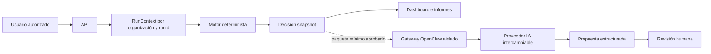

# OpenClaw en CyberDecisionEngine

## Decisión arquitectónica

OpenClaw es una capa reemplazable de orquestación analítica. No es fuente de verdad, recolector, motor de riesgo ni requisito para dashboard o informes. En Docker Compose el gateway está habilitado por defecto con `OPENCLAW_ENABLED=true`, imagen fijada a una versión estable y acceso exclusivo desde la red interna `ai_net`. Si no existe credencial de proveedor, el gateway permanece saludable pero el modelo se reporta `configured_unverified`; nunca se simula una respuesta.

## Entradas permitidas

- identificadores de organización y corrida;
- snapshot versionado;
- hechos y evidencia mínima autorizada;
- referencias compactas, estados, limitaciones y contradicciones;
- política, prompt versionado, presupuesto y esquema de salida.

No se envían secretos, cookies, contraseñas, datos de otra organización ni respuestas web tratadas como instrucciones.

## Salida obligatoria

Toda respuesta debe separar:

- hechos utilizados;
- inferencias;
- nivel de confianza;
- evidenceIds relacionados;
- limitaciones y advertencias;
- modelo y versión de prompt;
- herramientas solicitadas;
- fecha y correlación con `runId`.

La salida es una propuesta. No altera evidencia, scores, estados o informes finales.

## Capacidades de alto valor

- revisión de calidad de recolección;
- detección de contradicciones y faltantes;
- resolución de entidades propuesta;
- explicación de grafos, geointeligencia y riesgo;
- mapeos de amenazas propuestos con evidencia;
- borradores ejecutivos y técnicos;
- control de consistencia del informe;
- planes de trabajo sujetos a aprobación.

## Límites

- sin shell arbitrario;
- sin evasión de CAPTCHA, bloqueos o términos de servicio;
- sin navegación ofensiva ni autenticación en terceros;
- sin publicación automática;
- sin contacto a terceros;
- sin memoria compartida entre organizaciones;
- sin cambiar cálculos deterministas.

El contenedor aplica filesystem de solo lectura, `cap_drop: ALL`, `no-new-privileges`, límites de CPU/memoria, autenticación mediante token generado en un volumen efímero compartido y denegación expresa de navegador, shell, cron, escritura, búsqueda web y control del gateway. Habilitar una herramienta nueva exige cambio explícito de política y revisión humana.

## Degradación

Sin gateway, token, modelo, licencia o disponibilidad, la plataforma usa el mismo flujo determinista y registra la indisponibilidad. Ninguna corrida ni informe depende de OpenClaw.
