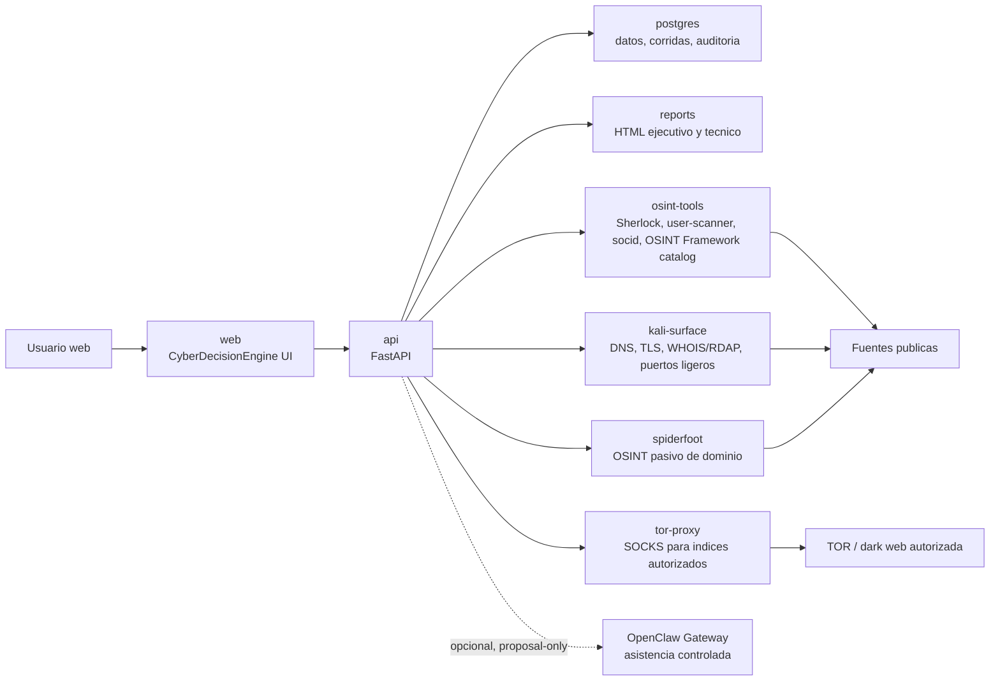
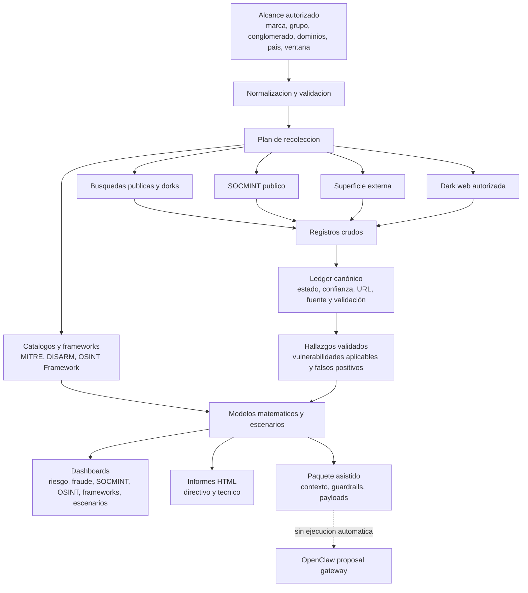
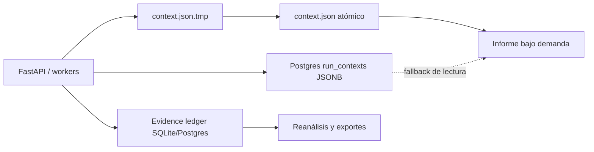

# CyberDecisionEngine Architecture

Created by Edwin Javier Peñuela Camacho. The model started in 2022 and is now
formalized as the P-CIDER v1.0 reference implementation.

## P-CIDER Implementation Rationale

CyberDecisionEngine implements P-CIDER because public cyber intelligence needs a
reproducible path from signal to decision. The theoretical reason is separation:
evidence quality, analytic confidence, contextual plausibility, business impact,
controls and residual risk are different variables. The practical reason is
control: every dashboard, report and export must be rebuilt from the same
`runId` snapshot, with no synthetic evidence and no double counting of controls.

## Integration Decisions

- `lockfale/osint-framework` is integrated as a local reference catalog only. The platform loads `arf.json`, filters resources by scope, and exposes metadata for OSINT planning. It does not run the OSINT Framework UI, worker, tracking routes, or third-party tools listed in the catalog.
- `openclaw/openclaw` is integrated as an optional analytical gateway for controlled proposal packages. It is disabled by default, uses proposal-only payloads, and must not execute shell, browser, channels, cron jobs, tools, or file writes from generated packages without explicit admin approval.

## Container Layout

## Evidence-First Intelligence Flow

## Persistence and Recovery

- `context.json` mantiene compatibilidad local y escritura atómica.
- `run_contexts.payload` conserva el contexto completo y permite recuperación si falta el archivo.
- El ledger indexa `canonical_id`, `evidence_status`, `record_kind`, activo, host, indicador y estado de vulnerabilidad.
- Los informes no se generan automáticamente al terminar la recolección.

## Trust Boundaries

- `web` solo consume la API; no consulta sidecars directamente.
- `api` valida alcance autorizado y orquesta fuentes.
- `osint-tools`, `kali-surface`, `spiderfoot` y `tor-proxy` están en redes internas sin UI pública.
- `tor-proxy` no publica SOCKS al host y opera sin privilegios, con filesystem de solo lectura y límites de recursos.
- Proveedores opcionales reciben paquetes controlados y modo `proposal_only`; no ejecutan shell, navegador ni cambios sin aprobación.

## OpenClaw Use With Least Privilege

- Best use: controlled assistant inside the platform for explaining runs, drafting executive/technical actions, preparing scheduled scan plans, and reviewing report quality.
- Docker default: `OPENCLAW_ENABLED=true` with a dedicated internal gateway; the deterministic pipeline remains independent.
- Runtime controls: generated token, no public exposure, no shared personal workspace, read-only filesystem and no unrestricted tools or plugins.
- CyberDecisionEngine payloads include an explicit `proposal_only` policy so OpenClaw returns analysis and plans, not direct operations.

## OSINT Framework Use

- The sidecar exposes `/tools/osint-framework`.
- Search scopes: `domain`, `group`, `person`, `socmint`, `darkweb`, `attack_surface`, `brand_fraud`.
- Each catalog entry is classified with `runtime_allowed`, `risk_flags`, `opsec`, `api`, `google_dork`, and `registration`.
- Catalog entries are not evidence. Evidence still requires a collected URL/result from configured collectors.
