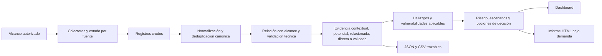

# CyberDecisionEngine: proceso, evidencia y modelos de cálculo

Modelo de ciberinteligencia estratégica diseñado por Edwin Peñuela desde 2022.

## 1. Propósito y límites

CyberDecisionEngine transforma registros públicos o autorizados en evidencia trazable, hallazgos, riesgos, escenarios y opciones de decisión. El proceso no convierte automáticamente una URL, un subdominio o una coincidencia de texto en amenaza, vulnerabilidad, incidente o atribución.

Los informes se generan bajo demanda a partir del contexto persistido de una corrida. Una fuente ausente, sin resultados o con timeout conserva ese estado y no se reemplaza con datos inventados.

## 2. Flujo verificable



## 3. Taxonomía obligatoria

Cada `ThreatEvent` conserva `canonical_id`, `content_hash`, `record_kind`, `evidence_status`, `confidence_score`, `confidence_level`, relación con alcance, resultado de validación, referencias de fuente y URL.

| Estado | Significado | Puede activar riesgo |
|---|---|---|
| `raw` | Registro recibido antes de clasificar | No |
| `contextual` | Contexto sin vínculo directo suficiente | No |
| `potential` | Señal que requiere validación | No |
| `related` | Relación parcial con el alcance | No por sí sola |
| `direct` | Evidencia pública directamente vinculada | Solo con regla accionable |
| `validated` | Evidencia técnica validada | Sí |
| `confirmed` | Hecho confirmado con criterio explícito | Sí |
| `false_positive` | Falso positivo identificado | No |
| `discarded` | Registro inválido o fuera de reglas | No |

Un hallazgo, una vulnerabilidad aplicable, un escenario activado y un incidente confirmado son entidades distintas. Los contadores no se reutilizan entre esas categorías.

## 4. Deduplicación y conteos

La identidad canónica prioriza: indicador externo estable; URL canónica sin parámetros de tracking; o combinación de dominio, host, activo, categoría, fecha, título normalizado y fuente. Los duplicados combinan fuentes, etiquetas y el mayor nivel de aseguramiento, pero no aumentan el número de registros únicos.

El resumen separa registros crudos, normalizados, únicos, descartados, duplicados, evidencia por estado, riesgos calculados, hallazgos validados, incidentes y falsos positivos.

## 5. Estado de conectores

Cada fuente declara si está habilitada, configurada, autenticada, consultada, exitosa, parcial, limitada por cuota, vencida por timeout, sin datos, no aplicable, deshabilitada o fallida.

- Cobertura: proporción operativa de conectores consultados.
- Salud: calidad de ejecución técnica de la fuente.
- Completitud: capacidad de la consulta para devolver una respuesta útil.
- `no_data`: consulta exitosa sin registros; no significa ausencia de riesgo.
- `timeout` o `rate_limited`: limitación de cobertura; tampoco eleva el riesgo.

## 6. Validación de superficie y correo

Un subdominio observado es inventario, no vulnerabilidad. Solo se vuelve hallazgo cuando hay una debilidad verificable, por ejemplo TLS débil, autenticación ausente, endpoint sensible o configuración de correo validada.

SPF y DMARC se consultan mediante TXT/DNS. La ausencia se registra únicamente si la consulta terminó correctamente y el dominio tiene contexto de correo. Un error temporal queda como evidencia potencial. DKIM permanece `not_assessed` si no existe selector conocido; no se infiere ausencia global.

La falta de SPF o DMARC se trata como brecha externa de control de correo, normalmente de riesgo bajo. No demuestra phishing ni ataque activo.

## 7. Vulnerabilidades

Una coincidencia CVE permanece `cve_candidate` hasta confirmar producto, versión y aplicabilidad al activo. Solo las etiquetas explícitas `version_confirmed` y `cve_applicable`, junto con evidencia directa o validada, permiten `cve_applicable`.

KEV y EPSS priorizan una vulnerabilidad ya aplicable; no crean aplicabilidad. Sin activo y versión confirmados, el informe muestra tecnología observada o candidato, nunca CVE confirmada.

## 8. Confianza de evidencia

```text
C = clip(
    0.25·peso_fuente + 0.25·relación_alcance + 0.10·frescura
  + 0.10·URL_presente + 0.15·validación + 0.10·diversidad_fuentes
  + 0.05·revisión_humana - 0.10·contradicciones
)
```

Bandas: muy baja `<0.20`, baja `<0.40`, media `<0.65`, alta `<0.85`, muy alta `>=0.85`.

## 9. Riesgo contextual

### 9.1 Actividad observable

```text
decaimiento(d,h) = exp(-ln(2)·d/h)
A = clip(1 - exp(-0.35·Σ(peso_fuente·confianza·decaimiento)))
```

### 9.2 Plausibilidad contextual

```text
L = sigmoid(z)
z = -2.10 + 0.70A + 0.85E + 0.75V + 0.90·logit(P)/6
    + 0.85K + 0.70T + 0.55S + 0.35G
    - 0.80C - 0.60D - 0.45R
```

`L` es un score acotado, no una probabilidad calibrada de ataque. `V`, `P` y `K` solo pesan si la vulnerabilidad es aplicable. `S` solo pesa si una evidencia asegurada contiene targeting sectorial explícito. `G` permanece en cero mientras no exista evidencia geográfica específica. Controles, detección y respuesta solo reducen riesgo si fueron declarados.

### 9.3 Impacto y controles

```text
I = 0.25·financiero + 0.20·operacional + 0.20·confidencialidad
  + 0.15·integridad + 0.10·disponibilidad + 0.05·legal
  + 0.05·reputacional

CE = 0.25·ISO + 0.25·NIST + 0.15·SOC2 + 0.15·D3FEND
   + 0.10·detección_ATT&CK + 0.10·respuesta

RI = 100·L·I
RR = RI·(1 - min(0.85, CE))
```

Los pesos de impacto son supuestos de priorización por categoría y se muestran como entradas del hallazgo. Los scores de control son autodeclarados y no equivalen a auditoría.

### 9.4 Matriz 4x4

```text
índice_L = ceil(4·L)
índice_I = ceil(4·I)
matriz = índice_L·índice_I
1-3 Bajo | 4-7 Medio | 8-11 Alto | 12-16 Crítico
```

El plan usa riesgo residual, confianza, exposición y urgencia del hallazgo. No se agregan acciones genéricas al plan si no existe evidencia o escenario soportado.

### 9.5 Sensibilidad Monte Carlo

El motor muestrea `L`, `I` y `CE` con distribuciones beta y semilla reproducible para obtener P10, P50 y P90 del riesgo calculado. Son bandas de sensibilidad, no intervalos de predicción de incidentes.

## 10. Índice de presión de señales

```text
r = min(0.04, 0.002 + 0.008·KEV + 0.004·sector
                    + 0.006·SOCMINT + 0.008·darkweb)
IPS(t) = 1 - exp(-r·t), para t en 7, 14 y 30 días
```

La banda inferior es `0.72·IPS` y la superior `1.32·IPS`, acotada a uno. Son variaciones de sensibilidad. `prediction_is_calibrated=false`; por ello la UI y los informes no pueden llamarlo probabilidad de ataque. El componente sectorial solo se activa con targeting sectorial explícito.

Para habilitar probabilidades se requiere outcome definido, histórico etiquetado, validación temporal, precision, recall, F1, PR-AUC o ROC-AUC, Brier Score, curva de calibración, matriz de confusión, tasas de error, drift y versión del modelo.

## 11. PESTEL y Porter

PESTEL y Porter son lentes de soporte contextual, no riesgo ni cumplimiento. Solo usan eventos `direct`, `validated` o `confirmed` con categoría o etiqueta explícita.

```text
soporte_dimensión = confianza_media · min(1, evidencias_únicas/5)
índice = promedio(soporte_dimensiones) · 100
```

Sin evidencia, el estado es `unassessed`, el índice es cero y no se crea escenario. País y sector declarados contextualizan la lectura, pero no crean señales ni elevan el resultado.

## 12. Marcos y escenarios

- ATT&CK: técnica exacta y `observed_adversary_behavior`, respaldado por telemetría, log, IP fuente o patrón validado.
- D3FEND: opción defensiva asociada; por sí solo no activa un escenario.
- ATLAS: identificador ATLAS explícito, señal de IA y confianza mínima de `0.65`.
- DISARM: identificador DISARM explícito, al menos dos evidencias y dos fuentes independientes.
- NIST, ISO, PCI, SOC 2, GDPR, CIS y COBIT: mapeos de recomendaciones o evidencia; no son porcentaje de cumplimiento ni auditoría.

La biblioteca contiene 1.500 plantillas preventivas con scores en cero. Los scores se calculan únicamente con evidencia de la corrida actual. Una coincidencia genérica de palabras no activa escenarios.

## 13. Índice de postura externa

```text
IPCE = 100·(0.40·salud_fuentes
          + 0.35·aseguramiento_evidencia
          + 0.25·(1 - riesgo_residual_máximo/100))
```

El Índice de Postura de Ciberinteligencia Externa evalúa salud de fuentes, proporción de evidencia asegurada y riesgo externo calculado. No evalúa MFA, EDR, SIEM, backup, IAM, cultura, procesos, continuidad, arquitectura o controles internos.

## 14. Persistencia y reportes

El contexto completo se escribe de forma atómica en `data/web_runs/<run_id>/context.json` y en Postgres `run_contexts.payload` cuando `DATABASE_URL` está configurado. Postgres es respaldo de lectura si el archivo no está disponible. Los eventos conservan además un ledger SQLite/Postgres con payload completo y campos canónicos indexados.

El informe ejecutivo explica alcance, conteos, postura externa, riesgos sustentados, presión de señales, escenarios soportados y plan priorizado. El técnico conserva dominios, activos, URLs completas, evidencia, validación, entradas matemáticas, vulnerabilidades, mappings, fuentes y limitaciones. JSON y CSV contienen el mismo modelo estructurado.

## 15. Principios anti-alucinación

- No mostrar datos predeterminados antes de una corrida.
- No presentar registros como amenazas ni subdominios como vulnerabilidades.
- No confirmar CVE sin producto, versión y aplicabilidad.
- No afirmar ATT&CK sin conducta adversaria observada.
- No activar ATLAS o DISARM con términos genéricos.
- No convertir ausencia de fuente en ausencia de riesgo.
- No generar incidentes, fraude, desinformación o dark web accionable sin evidencia suficiente.
- No usar controles desconocidos para reducir riesgo.
- No llamar probabilidad a un índice no calibrado.

## 16. Reproducibilidad

```bash
.venv/bin/pytest -q
pnpm --dir web run build
docker compose --profile osint --profile surface up -d --build
curl -fsS http://localhost:8000/api/health
curl -fsS http://localhost:8080/
```

Los resultados se conservan en `artifacts/validation_results.json`, `artifacts/test_results.txt` y `artifacts/before_after_summary.md`.
