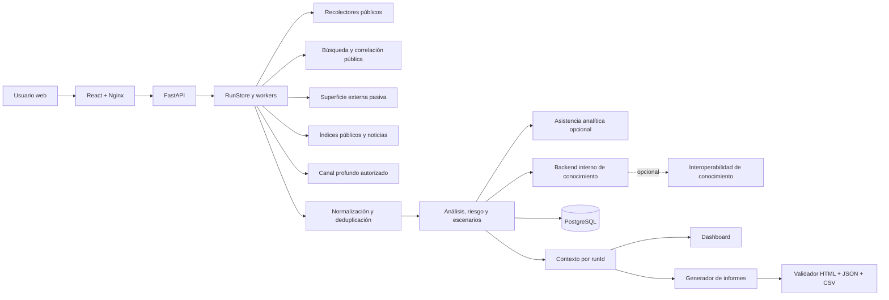
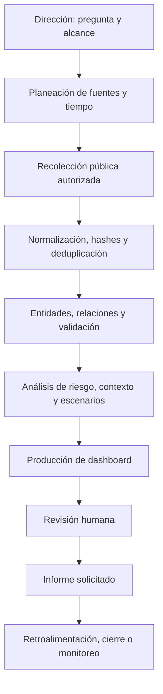

# Manual de CyberDecisionEngine

| Campo | Valor |
|---|---|
| Plataforma | CyberDecisionEngine |
| Versión de aplicación | 0.1.0 |
| Versión del manual | 1.2.0 |
| Fecha | 2026-08-20 |
| Clasificación | Uso interno / información pública autorizada |
| Creador conceptual | Edwin Peñuela, modelo desarrollado desde 2022 |

## 1. Introducción

CyberDecisionEngine transforma registros públicos y autorizados en evidencia normalizada, relaciones, hallazgos, escenarios y posibilidades de decisión. Está orientada a dirección, CISO, riesgo, fraude, SOC, infraestructura, legal y analistas de inteligencia.

La plataforma diferencia:

- **recolección:** obtención de registros desde una fuente;
- **procesamiento:** normalización, canonicalización, deduplicación y clasificación;
- **análisis:** evaluación reproducible de relaciones, riesgo y contexto;
- **inteligencia:** interpretación trazable que soporta una decisión;
- **informe:** representación ejecutiva o técnica de un snapshot persistido.

No explota vulnerabilidades, no autentica contra terceros, no realiza fuerza bruta y no convierte una mención en incidente.

## 2. Objetivo

La plataforma responde:

1. qué alcance fue analizado;
2. qué fuentes fueron consultadas y con qué resultado;
3. qué registros únicos fueron recolectados;
4. qué afirmaciones tienen evidencia;
5. qué escenarios son candidatos o están respaldados;
6. qué riesgo externo puede justificarse;
7. qué información falta;
8. qué posibilidades de tratamiento deben evaluarse.

No sustituye una auditoría interna, un pentest, un peritaje, una certificación, una evaluación legal ni la respuesta a incidentes.

## 3. Casos de uso

- evaluación pública de una organización o dominio autorizado;
- monitoreo periódico o 24/7 con alertas internas;
- OSINT de dominios, marca, noticias, advisories y documentos públicos;
- SOCMINT basado en contenido público indexado y atribuible;
- superficie externa defensiva: DNS, certificados, WHOIS, subdominios y tecnologías;
- inteligencia de vulnerabilidades con control de aplicabilidad;
- fraude y suplantación de marca;
- desinformación y mapeo DISARM;
- huella tecnológica pública IT, IoT, IIoT y OT;
- escenarios ATT&CK Enterprise/ICS, EMB3D, D3FEND, ATLAS, F3 y DISARM;
- contexto estratégico PESTEL/Porter;
- escenarios ATT&CK, D3FEND, ATLAS y DISARM;
- informe ejecutivo y técnico bajo solicitud del usuario;
- análisis separado de riesgo virtual de empleados con consentimiento.

## 4. Arquitectura

### Contenedores

| Servicio | Función | Exposición |
|---|---|---|
| `web` | interfaz y reportes | host 8080 |
| `api` | API y motor | host 8000 |
| `postgres` | datos persistentes | host 15432 para administración local |
| `public-collection` | búsqueda y correlación pública | solo red interna |
| `external-surface` | superficie defensiva pasiva | solo red interna |
| `deep-channel` | canal profundo autorizado | solo red interna |
| `analysis-assistant` | asistencia analítica controlada | solo red interna, sin puerto host |

### Fuente de verdad

Cada ejecución produce un `RunContext` persistido bajo `data/web_runs/<runId>/context.json` y replicado en PostgreSQL. Dashboard, informe ejecutivo, informe técnico, JSON y CSV se derivan del mismo `DecisionIntelligenceSnapshot`.

## 5. Despliegue y operación

La topología soportada usa Docker Compose, PostgreSQL y servicios internos sin exponer sidecars de recolección al host. El manual funcional no depende de una ruta local ni de un sistema operativo específico.

Los prerrequisitos, variables, arranque, migraciones, respaldo, restauración, actualización, observabilidad y comandos reproducibles están separados en `docs/operacion/Guia_Despliegue_y_Operacion.md`. Los secretos permanecen fuera del repositorio y nunca deben aparecer en informes.

## 6. Configuración

### Organización y alcance

Una ejecución organizacional requiere al menos un dominio o nombre de organización/marca y `authorized_scope=true`. La investigación de personas pertenece exclusivamente al módulo **Riesgo virtual de empleados**, con permisos, minimización, retención e informe separados. Campos principales:

- marca, grupo o conglomerado;
- dominios propios;
- sector y una o varias actividades o subsectores, con texto libre para no limitar industrias como aviación, transporte, energía o minería;
- país y países de operación;
- marcas, filiales, productos y activos estratégicos;
- proveedores críticos y terceras partes declaradas;
- competidores declarados y dominios comparativos, almacenados fuera del alcance técnico propio;
- ventana temporal;
- modo `snapshot` o `deep`;
- presupuesto de tiempo;
- autorización Tor;
- idioma español o inglés.

Los dominios comparativos se almacenan aparte y no se mezclan con el alcance propio.

### Fuentes

Las credenciales de capacidades externas son opcionales. Su ausencia debe producir `disabled`, `not_applicable` o `skipped`, nunca registros simulados. El backend interno continúa disponible sin interoperabilidad externa.

## 7. Operación paso a paso

1. Inicie sesión con un rol habilitado.
2. Cree o seleccione una empresa si corresponde.
3. Abra **Overview**; allí se integran alcance, configuración, ejecución, progreso y resumen de resultados.
4. Escriba la marca/organización y dominios autorizados.
5. Defina sector, actividades, países, proveedores críticos, competidores, ventana, profundidad y Tor.
6. Confirme el alcance.
7. Lance la ejecución.
8. Observe `Estado de corrida`; cada etapa cambia progreso y estado.
9. Revise cobertura de conectores y errores parciales.
10. Desde Overview abra tablero estratégico, evidencia, superficie, OSINT, Inteligencia SOCMINT y posibilidades soportadas.
11. Valide o descarte evidencia desde el ledger.
12. Solicite el informe con el botón **Generar informe** y elija revisión manual o asistida.
13. En modo manual los registros conservan su estado hasta que el usuario decida. En modo asistido el motor prioriza y explica qué revisar, pero no valida ni descarta automáticamente.
14. Revise el resultado del validador del informe.
15. Descargue HTML, JSON o CSV.

Cerrar sesión no detiene el worker: la ejecución vive en la API y queda persistida.

## 8. Proceso de inteligencia

## 9. Fuentes y estados

El catálogo puede incluir búsqueda pública, noticias y RSS, inteligencia de vulnerabilidades, DNS/certificados/WHOIS, superficie externa, índices autorizados de canal profundo e interoperabilidad CTI. La interfaz muestra la capacidad pública y su estado operativo; los nombres de implementación permanecen en documentación interna del operador.

Estados del ciclo de vida:

- `registered`: el conector existe en el catálogo;
- `eligible`: configuración, licencia y alcance permitían consultarlo;
- `attempted`: la corrida inició una consulta real;
- `succeeded`: la consulta terminó sin fallo;
- `productive`: entregó al menos un registro;
- `empty`: consulta correcta sin registros relacionados;
- `degraded`: resultado parcial, timeout o rate limit con respuesta utilizable;
- `skipped`: no se intentó por una regla explícita;
- `unconfigured`: faltó configuración obligatoria;
- `failed`: error técnico sin resultado utilizable.

Los KPI usan denominadores explícitos: productividad sobre intentadas y cobertura sobre elegibles. Los conectores registrados nunca inflan por sí solos la salud operativa.

Una fuente real indica procedencia real; no convierte cada afirmación en verdadera.

## 10. Normalización y deduplicación

Cada registro conserva el dato original y añade:

- identificador canónico;
- hash de contenido;
- URL canónica;
- timestamp observado;
- tipo de registro;
- relación con el alcance;
- estado de evidencia;
- confianza;
- referencias de fuente;
- número de duplicados;
- resultado y método de validación.

Duplicados exactos se agrupan por identidad/hash. Copias sindicadas no multiplican automáticamente el impacto. La evidencia original y la interpretación permanecen separadas.

## 11. Análisis realizados

### OSINT

Consolida información pública relacionada con el alcance. Muestra consultas, registros, fuentes, URLs y limitaciones. Un resultado por coincidencia de palabra permanece relacionado o candidato hasta validar relación directa.

### SOCMINT

Trabaja con menciones y perfiles públicos indexados. Los nodos representan entidades presentes en registros; las aristas representan relaciones derivadas de evidencia. Si no hay datos, no se dibuja una red.

### Superficie externa

Revisa DNS, correo, certificados, WHOIS, subdominios y tecnologías mediante técnicas defensivas. Un servicio visible no es vulnerabilidad. Una CVE solo se vuelve aplicable si producto y versión pueden justificarse.

### Marca y fraude

Busca suplantación, dominios similares y narrativas relacionadas. La similitud lexical es una señal, no prueba de fraude. El impacto reputacional requiere evidencia de alcance, contexto y corroboración.

### Relaciones, terceras partes y dominios similares

El motor separa tres lecturas:

- **terceras partes:** proveedores declarados o relaciones explícitamente observadas; una relación sin evidencia de riesgo permanece como contexto;
- **dominios similares:** únicamente hosts que aparecieron en registros de la corrida; nunca se generan dominios hipotéticos para presentarlos como observados;
- **contexto competitivo:** competidores declarados o representados por evidencia para Porter y PESTEL; la declaración no suma riesgo técnico.

Una puntuación de atención de terceros solo se calcula cuando existe evidencia directa, validada o confirmada con términos de riesgo. Un dominio parecido nunca se presenta como malicioso sin validar titularidad, contenido, uso y relación con el alcance.

### Dark web

Usa índices y metadatos autorizados. Tor es opcional. No descarga datos robados ni interactúa con mercados. `no_data` describe la cobertura disponible, no ausencia global.

### Desinformación

Mapea registros compatibles a DISARM. Sin evidencia posterior a la corrida, las tácticas no se muestran como activas.

### Vulnerabilidades

Combina CVE, CVSS, EPSS y KEV con aplicabilidad. CVSS mide severidad técnica; EPSS estima explotación de CVE; KEV registra explotación conocida; ninguno prueba afectación del activo sin identificación tecnológica.

### PESTEL y Porter

Clasifican clusters de evidencia vinculada al sujeto: información corporativa, regulatoria, sectorial, financiera, tecnológica, operacional, de sostenibilidad y noticias públicas. El análisis se calcula una vez para la marca, grupo o conglomerado y sus dominios propios; los comparativos permanecen fuera del alcance. Cada dimensión muestra cobertura de evidencia aunque todavía no exista soporte suficiente para publicar una presión direccional. La presión agregada solo se publica cuando cobertura >= 60 %, confianza >= 50 y más de la mitad de dimensiones tienen datos puntuables. Cobertura no es riesgo, cumplimiento ni probabilidad de ataque.

Las actividades, geografías, proveedores, competidores, productos y activos declarados amplían las consultas estratégicas. El motor busca contexto de actores, campañas, TTP, interrupciones, regulación, mercado y cadena de suministro relacionado con ese alcance. Una noticia sectorial orienta la decisión, pero no se convierte automáticamente en un ataque contra la organización.

### Huella tecnológica pública y escenarios

La huella clasifica observaciones externas en IT, IoT, IIoT, OT o sin clasificar. Cada registro conserva atribución `posible`, `relacionada`, `observada públicamente`, `corroborada públicamente` o `confirmada`, sin convertir una mención en inventario interno.

El catálogo contiene 1.138 **plantillas preventivas de referencia**, no escenarios ejecutables: 1.116 derivadas de marcos y 22 multidominio. Una posibilidad se muestra como candidata solo cuando evidencia de la corrida satisface criterios explícitos de relación, actualidad y atribución. `corroborada públicamente` requiere al menos dos referencias independientes. Una vulnerabilidad aplicable exige producto y versión o CPE. Esto no confirma ataque, compromiso ni incidente.

> Este análisis se basa en evidencia pública y observaciones externas consolidadas por CyberDecisionEngine. No constituye un inventario interno, auditoría, prueba de compromiso, confirmación de firmware instalado ni certificación de cumplimiento.

## 12. Matemáticas y cálculos

**Versión de riesgo residual:** `P-CIDER 1.0.0`.
**Versión de evidencia:** `1.0.0`.
**Versión claim-evidence:** registrada en cada contexto.

### Actividad de amenazas

Para cada registro `i`:

`T = sum(sourceWeight_i * confidence_i * 2^(-ageDays_i / halfLife_i))`

`A = 1 - exp(-0.35 * T)`

El resultado está acotado a `[0,1]` y normaliza saturación de volumen. No es probabilidad.

### Plausibilidad contextual P-CIDER

`L_raw = sigmoid(-2.10 + 0.70A + 0.85E + 0.75V + 0.90logit(P)/6 + 0.85K + 0.70TTP + 0.55S + 0.35G)`

`L = DS*L_raw + (1-DS)*base_rate`

Variables: actividad, exposición, vulnerabilidad, prior EPSS, KEV, TTP, sector,
geografía, suficiencia de datos y tasa base conservadora. Es una heurística
versionada, no un modelo predictivo calibrado. Los controles, detección y
respuesta no reducen `L`; se aplican una sola vez al riesgo residual.

### Impacto

`I = 0.25F + 0.20O + 0.20C + 0.15In + 0.10A + 0.05L + 0.05R`

Los pesos suman 1.0. Datos ausentes no deben sustituirse por cero observado.

### Efectividad de controles

`CE_raw = 1 - product((1 - e_c)^w_c)`

`CE = min(0.85, CE_raw)`

El valor máximo aplicado al riesgo residual es 0.85 para evitar una reducción total no justificable.

### Riesgo

`R_inherent = 100 * L * I`

`R_residual = R_inherent * (1 - min(0.85, CE))`

Ejemplo: `L=0.40`, `I=0.60`, `CE=0.50`. Riesgo inherente `24`; residual `12`.

### Matriz 4x4

`L` e `I` se discretizan en 1..4 y se multiplican. 1-3 bajo, 4-7 medio, 8-11 alto, 12-16 crítico.

### Monte Carlo

Muestrea distribuciones beta alrededor de `L`, `I` y `CE` con semilla reproducible y reporta p10, p50 y p90. Son bandas de sensibilidad del modelo, no intervalos de una frecuencia observada.

### Índice de presión de señales

La implementación activa muestra bandas de sensibilidad derivadas de intensidad reciente cuando existen datos suficientes. La función Poisson permanece registrada como `reference_only`, sin caller productivo ni calibración; por ello no se publica como probabilidad de ataque.

### PESTEL/Porter operativo

Cada cluster aporta `match * quality * recency * directness * novelty * corroboration * extraction * mapping`; la presión final usa una transformación `tanh` acotada. La cobertura ponderada de evidencia se calcula por separado para impedir que un dato real pero no direccional se convierta en un cero o porcentaje inventado. Sin umbral de cobertura/confianza, la presión queda `insufficient_evidence`, pero el tablero conserva los aspectos respaldados, sus fuentes y la cobertura disponible. Las funciones heredadas `pestel_cyber_index` y `porter_cyber_index` no son el cálculo productivo actual.

## 13. Marcos de referencia

- ATT&CK 19.1: comportamiento adversario y técnicas;
- ATT&CK ICS: comportamiento adversario sobre sistemas de control industrial;
- EMB3D 2.0.2: amenazas y mitigaciones para dispositivos embebidos;
- D3FEND 1.4.0: contramedidas defensivas;
- ATLAS 5.6.0: amenazas contra sistemas de IA;
- DISARM: tácticas de desinformación;
- NIST CSF 2.0: resultados de gobierno y ciberseguridad;
- ISO 27001:2022: áreas de control mediante resúmenes no propietarios;
- PCI DSS 4.0.1, SOC 2, GDPR, CIS Controls y COBIT: cobertura de mapeo.

Un porcentaje de framework significa cobertura de mapeo de señales, no cumplimiento.

## 14. Dashboard

El dashboard debe leerse de arriba hacia abajo:

1. alcance y ventana;
2. estado y duración;
3. cobertura de conectores;
4. registros únicos y hallazgos;
5. distribución web/geográfica;
6. confianza y limitaciones;
7. riesgo;
8. relaciones;
9. cambios históricos;
10. posibilidades de decisión.

Cada KPI se deriva del snapshot y debe enlazar al detalle. `0 observado` y `sin datos` son estados diferentes.

## 15. Distribución geográfica

Las ubicaciones deben distinguir coordenada exacta, ciudad, región, país, infraestructura e inferencia. Nunca se usa una coordenada arbitraria para datos sin ubicación. Una IP puede representar infraestructura y no una persona. La precisión y confianza deben acompañar el punto o agregado.

## 16. Inteligencia SOCMINT y grafos

- nodo: persona, organización, cuenta, dominio, alias, correo, publicación, URL, hashtag, evento o infraestructura;
- arista: relación sustentada o inferida, con dirección, peso, fecha y evidencia;
- degree: número de relaciones;
- in/out-degree: relaciones entrantes/salientes;
- betweenness: capacidad de puente;
- densidad: relaciones presentes respecto de las posibles;
- comunidad: grupo estructural detectado.

Centralidad alta no implica culpabilidad, intención ni control. Las métricas se muestran solo con suficiente estructura.

## 17. Lectura de informes

### Ejecutivo

Presenta alcance, cobertura, hallazgos validados, riesgo, contexto y plan de trabajo. Usa referencias compactas y enlaza a evidencia. No contiene respuestas técnicas completas.

### Técnico

Incluye consulta, respuesta original disponible, URL, hash, timestamp, fuente, entidad, relación, validación, contradicciones y limitaciones. Las evidencias HTTP(S) públicas priorizadas pueden incluir una captura aislada con hash, dimensiones, URL final, código HTTP y fecha; la imagen amplía al seleccionarla. Una captura demuestra el contenido observado en ese momento, no confirma por sí sola la interpretación. Permite reconstruir el análisis.

La generación ejecuta preparación analítica, renderizado y validación en un proceso separado del servidor web. Así una corrida grande puede producir informes sin bloquear la API ni dejar en blanco los tableros. El informe conserva el mismo `runId`, snapshot, hash y versión del modelo que el dashboard.

### Estados

- candidato: relación pendiente;
- respaldado: evidencia relacionada suficiente para análisis;
- validado: método y evidencias registradas;
- confirmado: supera umbral y no tiene contradicción crítica abierta;
- materializado: impacto de seguridad demostrado.

## 18. Modelo claim-evidence

Toda afirmación importante recorre:

`Claim -> Evidence -> Interpretation -> Limitation -> Decision -> Closure`

Cada hallazgo explica qué se encontró, qué demuestra, qué no demuestra, cómo se validó, confianza, limitaciones, decisión, responsable y criterio de cierre.

## 19. Asistencia analítica opcional

La asistencia analítica es una capa reemplazable, no el núcleo. Puede preparar borradores, explicar scores, detectar contradicciones y proponer consultas; no publica, no cambia scores ni ejecuta comandos arbitrarios. La plataforma funciona completamente sin esta capacidad.

Antes de generar un informe, la revisión asistida aplica una clasificación determinista y trazable a cada registro revisable: ya revisado, requiere validación humana, posible falso positivo o contexto. Esta salida es una propuesta; `automatic_validation=false` es obligatorio y el estado original no cambia hasta una acción humana registrada.

El tablero **Asistente estratégico** trabaja siempre sobre la corrida seleccionada. El usuario puede elegir los módulos que forman el contexto, formular preguntas ejecutivas o técnicas, abrir los tableros relacionados y solicitar con lenguaje natural la generación de los informes ejecutivo y técnico. La conversación se separa por `runId`; el historial del usuario se trata como solicitud no confiable y nunca como evidencia.

El botón **Análisis profundo** prepara un paquete acotado a la corrida y activa,
según los módulos elegidos, agentes especializados de calidad de recolección,
confiabilidad de fuentes, evidencia estratégica, causalidad, narrativas,
contradicciones, escenarios, riesgo, síntesis ejecutiva y consistencia.

La ejecución usa una arquitectura híbrida:

1. un planificador selecciona hasta tres especialistas en modo interactivo o
   seis en modo profundo;
2. cada especialista reduce de forma determinista solo los datos de su alcance;
3. un sintetizador determinista produce la respuesta interactiva inmediata, u
   el motor opcional realiza una única síntesis profunda con el perfil autorizado;
4. un verificador determinista comprueba que las referencias pertenezcan al
   `runId`;
5. la interfaz muestra la traza, el estado y las limitaciones de cada etapa.

No se ejecuta un modelo generativo independiente por agente. Así se evita
duplicar contexto, competir por memoria y multiplicar latencia. Los agentes son
roles lógicos sin acceso a shell, navegación ni escritura.

Las cifras, estados, cobertura y enlaces no los calcula un modelo generativo. Se leen directamente de la fuente de verdad de la corrida y llevan referencias `kpi:*`. La conversación sintetiza reducciones especializadas; si el motor falla, la respuesta se limita a una lectura verificable y registra la limitación. Sin hallazgos validados, ninguna ruta puede convertir registros relacionados o contextuales en hechos. La generación de informes continúa siendo determinista y solo ocurre por una acción explícita del usuario.

La configuración publica el modo, número máximo de especialistas, síntesis y validación posterior, sin exponer el producto interno utilizado. Si la capacidad falla, la recolección, los cálculos, los tableros y los informes continúan operando. Una salida incompleta se reemplaza por una respuesta segura basada en KPI y nunca se publica como conclusión.

El contenido web se trata como dato no confiable. Las salidas deben registrar hechos, inferencias, evidencia, confianza, versión del motor y limitaciones. La aprobación humana permanece obligatoria. Una respuesta vacía, `NO_REPLY`, una referencia desconocida o un desbordamiento de contexto no se marca como análisis completado.

## 20. Interoperabilidad de conocimiento

El backend interno es suficiente para operar. La interoperabilidad externa permanece opcional y deshabilitada por defecto. Cuando se habilita sincronización validada, solo transmite entidades y relaciones aprobadas; nunca datos brutos, caché, falsos positivos o propuestas no aprobadas.

### Inteligencia CTI especializada

El menú **CTI - Threat-Informed Intelligence** consume el snapshot canónico de
la corrida. Presenta actores, campañas, TTP, matriz ATT&CK, relaciones,
victimología, controles D3FEND y evidencia enlazada. Sus estados son
`OBSERVED`, `INFERRED`, `RELATED` y `REFERENCE`; una coincidencia contextual no
se publica como ataque observado. El score mostrado es relevancia contextual,
no probabilidad de ataque. La arquitectura, fórmula y reglas de lectura se
detallan en `docs/arquitectura/CTI_THREAT_INFORMED_ARCHITECTURE.md`.

## 21. Seguridad y privacidad

- alcance autorizado obligatorio;
- redes Docker separadas;
- sidecars sin puertos host;
- capacidades Linux eliminadas y `no-new-privileges`;
- secretos fuera del repositorio;
- roles y licencias por organización;
- logs y auditoría;
- TLP/PAP en evidencia;
- sesiones y MFA disponibles en la capa local, pendientes de IdP/SSO para producción;
- asistencia analítica en modo propuesta y lista de capacidades permitidas;
- redacción de datos sensibles en informes.

## 22. Administración

El rol de superadministración gestiona empresas, licencias, usuarios, módulos y
auditoría. El rol de administración gestiona usuarios de su empresa. No existen
cuentas ni contraseñas predeterminadas en el repositorio. Las credenciales deben
solicitarse al propietario en
[edwinjavpenuela@gmail.com](mailto:edwinjavpenuela@gmail.com) y entregarse por un
canal seguro. Antes de producción, el control de acceso debe aplicarse
server-side con JWT/refresh o SSO, MFA, revocación y hashing robusto.

## 23. Solución de problemas

| Síntoma | Verificación | Acción |
|---|---|---|
| Web no abre | `docker compose ps` | reconstruir `web` y revisar 8080 |
| API no responde | `/api/health`, logs API | validar PostgreSQL y reiniciar API |
| corrida no avanza | `GET /api/runs/<runId>` | revisar etapa, timeout y conectores |
| conector sin datos | estado y `message` | no confundir con cero; revisar cuota/alcance |
| Tor parcial | logs de `tor-proxy` | validar `allow_tor` y red interna |
| informe rechazado | `_validation.json` | corregir evidencia, referencias o conteos y regenerar |
| ciudades tardan | red del navegador | el catálogo se carga de forma diferida |
| Python local falla | `python --version` | usar Docker o Python 3.13 |

## 24. Glosario y anexos

- **registro recolectado:** dato obtenido de una fuente;
- **evidencia validada:** registro unido a una afirmación mediante método registrado;
- **hallazgo:** condición analizada que cumple reglas de evidencia;
- **confianza:** calidad de soporte de una afirmación;
- **likelihood:** plausibilidad contextual heurística;
- **riesgo:** likelihood, impacto y controles con evidencia;
- **alerta:** regla, umbral, responsable, acción y estado;
- **incidente confirmado:** impacto de seguridad demostrado y estado de respuesta;
- **runId:** identidad única de una ejecución;
- **snapshot:** fuente canónica de dashboard e informes;
- **TLP/PAP:** restricciones de distribución y acción.

### Checklist operativo

- [ ] alcance autorizado;
- [ ] sujeto y dominios sin valores por defecto;
- [ ] ventana y país definidos;
- [ ] conectores revisados;
- [ ] corrida completada;
- [ ] evidencia crítica inspeccionada;
- [ ] afirmaciones sin huérfanos;
- [ ] informe solicitado por el usuario;
- [ ] validador aprobado;
- [ ] limitaciones comunicadas;
- [ ] cierre o monitoreo asignado.

### Documentos relacionados

- `docs/SEMANTIC_MODEL.md`
- `docs/EVIDENCE_MODEL.md`
- `docs/CLAIM_EVIDENCE_GUIDE.md`
- `docs/TERM_DICTIONARY.md`
- `docs/HOW_TO_READ_REPORTS.md`
- `docs/manual/Manual_Inteligencia_Multidominio.md`
- `docs/arquitectura/inteligencia-multidominio.md`
- `docs/arquitectura/CTI_THREAT_INFORMED_ARCHITECTURE.md`
- `docs/operacion/CTI_KNOWLEDGE_UPDATE_RUNBOOK.md`
- `docs/auditoria/00-diagnostico-inicial.md`
- `docs/auditoria/01-optimizacion-geografica.md`
- `docs/auditoria/02-matriz-referencias.md`
- `docs/auditoria/03-ejecuciones-sinteticas.md`
- `docs/roadmap/Mejoras_Recomendadas.md`
