# Arquitectura de inteligencia estrategica basada en noticias

## Proposito

El motor PESTEL y Porter calcula presion estrategica contextual. No calcula
ciberriesgo, probabilidad de ataque, cumplimiento, madurez, vulnerabilidades ni
incidentes. Una dimensión sin evidencia conserva `signalScore = null` y
`status = no_data`; una dimensión relacionada pero no validada permanece visible
como `candidate/under_review`.

## Flujo determinista

```mermaid
flowchart LR
    A["Alcance declarado"] --> B["EntityResolutionGraph"]
    B --> C["Consultas directas, de grupo y contextuales"]
    C --> D["Noticias y publicaciones publicas"]
    D --> E["Resolucion y desambiguacion de entidades"]
    E --> F["Deduplicacion por URL, hash y similitud"]
    F --> G["StrategicEventCluster"]
    G --> H["Taxonomia de eventos"]
    H --> I["Matriz PESTEL y Porter versionada"]
    I --> J["SignalScore, confianza, cobertura y presión validada"]
    J --> K["PostgreSQL, JSON, CSV, tablero e informes HTML"]
```

## Resolucion de entidades

`EntityResolutionGraph` se construye solo con datos declarados en la corrida:

- nombre legal y comercial;
- marcas y alias administrados;
- dominios primarios y comparativos;
- matrices, filiales, productos y activos;
- proveedores criticos y competidores declarados;
- pais, sector y subsector.

Una coincidencia se acepta por dominio exacto, nombre legal exacto, alias
validado con contexto, o relacion declarada. Un alias de tres caracteres o
menos exige contexto adicional. Por ejemplo, `ODL` sin dominio, pais o sector
compatible se rechaza como ambiguo.

## Capas de consulta

1. Directa: dominio, nombre legal, marca, filial, producto o activo exacto.
2. Grupo: matriz, filial, proveedor critico o competidor declarado.
3. Contextual: sector mas pais y temas regulatorios, tecnologicos, de
   continuidad o estructura competitiva.

Las consultas se registran en `strategic_news.query_log`. Los registros de una
corrida conservan texto, tipo, entidades, idioma, pais, sector y ventana.

## Articulos, fuentes y clusters

Cada `NewsArticle` conserva URL original y canonica, fuente, titulo, hash,
fecha, idioma, coincidencias de entidad, directitud, tipo de evento, magnitud,
direccion, calidad, recencia, corroboracion y estado de evidencia.

Los articulos se agrupan por URL canonica, hash de contenido, similitud de
titulo, entidades y tipo de evento. Las republicaciones aumentan como maximo la
corroboracion. No multiplican linealmente el impacto. Una fuente propia se
marca `self_reported`: puede demostrar el anuncio, pero no cuenta como
corroboracion independiente.

## Registros versionados

- `data/strategic/strategic_event_taxonomy.json`
- `data/strategic/strategic_mapping_matrix.json`
- `data/strategic/source_reliability_registry.json`
- `data/strategic/entity_alias_registry.json`
- `data/strategic/scenario_strategic_context_mapping.json`

La taxonomia clasifica el hecho antes del mapeo. La matriz declara fuerza base,
direccion, condiciones, exclusiones, justificacion y version. El tono de la
noticia no determina la direccion estrategica.

## Persistencia

El contexto completo permanece en `run_contexts.payload`. Adicionalmente se
mantienen:

- `strategic_news_articles`;
- `strategic_event_clusters`;
- `strategic_score_snapshots`.

Las claves incluyen `run_id`, lo que permite reconstruir cada informe y evita
mezclar ventanas o empresas.

## Contexto de escenarios

PESTEL y Porter no crean ni activan escenarios. Un ajuste solo puede aplicarse
a un escenario ya `supported`, `evidence_supported` o `validated`, con una
relacion causal aprobada y confianza de dimension de al menos 60. El
multiplicador queda limitado a `0.90 - 1.10`. El registro de mapeos parte vacio
para no inventar causalidad.

## Asistencia analítica opcional

Una capa asistida puede proponer extracciones o explicaciones, pero el motor
implementado no depende de modelos generativos para calcular. La resolucion
definitiva, deduplicacion, ponderacion, umbrales, score y confianza son
deterministas y reproducibles.
